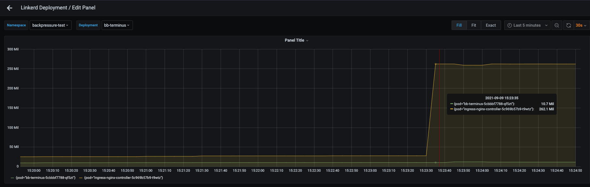

# Observing Proxy Memory Under Load
Once you have deployed the workloads using `deploy.sh`, start the linkerd
dashboard with the `linkerd viz dashboard` command.

From there:
- click on the grafana icon to the right of the `bb-terminus`
deployment in the backpressure-test namespace to open the grafana dashboard
- in the top right corner of the grafana dashboard, click the "add panel" button

- use the `default` source (which should be prometheus)
- in the `Metrics` field enter:
`sum(container_memory_usage_bytes{namespace=~"backpressure-test|ingress-nginx",container="linkerd-proxy"}) by (pod)`

- grafana will automatically generate the dashboard when the focus is moved out
of the `Metrics` field

You should see a graph showing the memory usage of the linkerd-proxy container
in the nginx-ingress and bb-terminus pods:

Add another `Deployment` of slow cooker which sends 100k RPS:
- `kubectl apply -f k8s/slow-cooker-100k.yml`

Observe that the linkerd-proxy injected into the ingress controller reaches the
maximum `resources.memory.limit` value and the container is restarted

